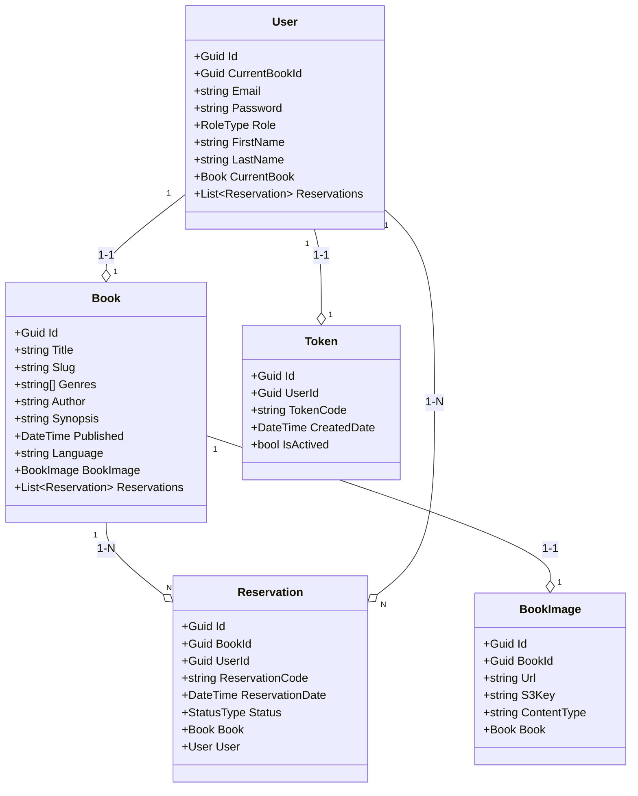

## Sobre o projeto
A Library API é um sistema para gerenciamento de livros e reservas de uma livraria. Este projeto foi desenvolvido em .NET e inclui integrações com MySQL para persistência de dados e AWS S3 para upload de imagens de livros. A aplicação é conteinerizada com Docker, facilitando sua execução e deploy em diferentes ambientes.

### Funcionalidades

- Cadastro de livros
- Sistema de reservas de livros
- Autenticação e autorização com JWT
- Upload de imagens de capas de livros utilizando o AWS S3
- Gerenciamento de usuários com diferentes níveis de permissão
- Documentação Swagger
- Teste de Unidade

### Construído com
![badge-dot-net]
![badge-my-sql]
![badge-swagger]
![badge-aws]
![badge-docker]
![badge-git-hub-actions]

## Diagrama de classes



## Getting Started

Para obter uma cópia local funcionando, siga passos simples

### Requisitos
* Docker e Docker Compose
* Credenciais AWS (para uso do S3)

### Instalação
1. Clone o repositório
```sh
git clone https://github.com/ViniciusSouzaDosReis/library-api
```
2. Crie o arquivo `.env`

* Crie um arquivo `.env` na raiz do projeto com as seguintes variáveis:
```sh
DB_CONNECTION_STRING="Server=database;Port=3306;Database=LIBRARYDB;Uid=root;Pwd=root"

# AWS settings
AWS_PROFILE=default
AWS_REGION=sa-east-1
AWS_ACCESS_KEY=your_aws_access_key
AWS_SECRET_KEY=your_aws_secret_key
AWS_S3_BUCKET_NAME=your_bucket_name
AWS_S3_BUCKET_KEY=your_bucket_key

# JWT settings
JWT_SECRET=your_jwt_secret
JWT_EXPIRATION_IN_MINUTES=30
```
* Substitua `your_aws_access_key`, `your_aws_secret_key`, `your_bucket_name`, `your_bucket_key` e `your_jwt_secret` pelos seus próprios valores.

3. Build e Execute com Docker

* Certifique-se de que o Docker e o Docker Compose estão instalados. Para iniciar o projeto, execute:
```sh
docker-compose up --build
```
* Isso irá iniciar os containers com o banco de dados MySQL e a aplicação .NET.

## URL da documentação no Swagger

[http://localhost:8000/swagger/index.html](http://localhost:8000/swagger/index.html)

### Tabela de Usuários e Permissões

| Usuário  | E-mail           | Senha            | Permissões                                                                     |
|----------|------------------|------------------|--------------------------------------------------------------------------------|
| **User** | user@user.com     | user1234567890   | Listar livros, Buscar por slug, Pegar lista de livros reservados, Criar reserva |
| **Admin**| admin@admin.com   | admin1234567890  | Todas as permissões                                                            |

## Tests
| Contexto  | Tipo           | Status            |
|----------|------------------|------------------|
| Back-End  | Unitário           | [](https://github.com/ViniciusSouzaDosReis/library-api/actions/workflows/unit-test.yml)            |


<!-- Links -->
[dot-net-sdk]: https://dotnet.microsoft.com/en-us/download/dotnet/8.0

<!-- Badges -->
[badge-dot-net]: https://img.shields.io/badge/.NET-512BD4?logo=dotnet&logoColor=fff&style=for-the-badge
[badge-visual-studio]: https://img.shields.io/badge/Visual%20Studio-5C2D91?logo=visualstudio&logoColor=fff&style=for-the-badge
[badge-my-sql]: https://img.shields.io/badge/MySQL-4479A1?logo=mysql&logoColor=fff&style=for-the-badge
[badge-swagger]: https://img.shields.io/badge/Swagger-85EA2D?logo=swagger&logoColor=000&style=for-the-badge
[badge-git-hub-actions]: https://img.shields.io/badge/GitHub%20Actions-2088FF?logo=githubactions&logoColor=fff&style=for-the-badge
[badge-docker]: https://img.shields.io/badge/Docker-2496ED?logo=docker&logoColor=fff&style=for-the-badge
[badge-aws]: https://img.shields.io/badge/AWS-%23FF9900.svg?style=for-the-badge&logo=amazon-aws&logoColor=white
